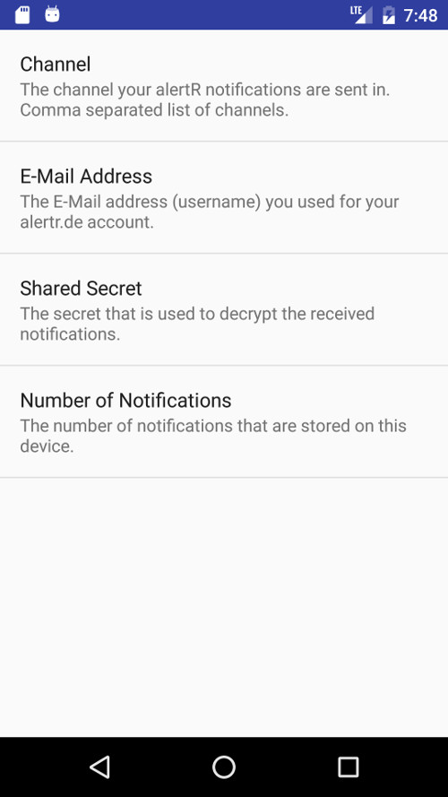
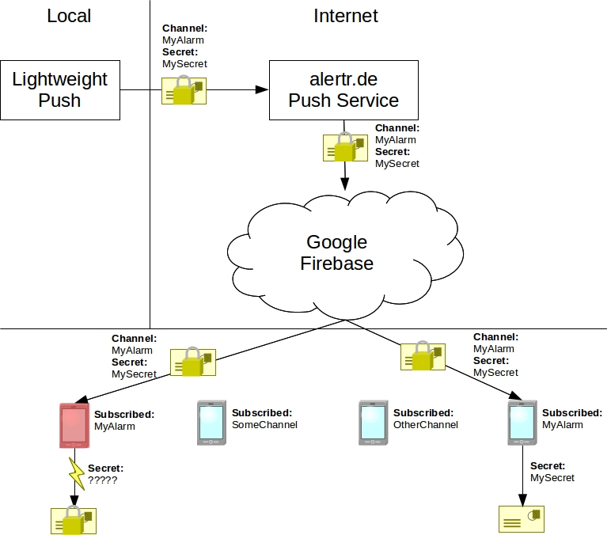

# Lightweight Push

Lightweight Push is a simple and easy to use push service. It lets you send end-to-end encrypted push messages to your Android mobile devices without hosting your own services or building your own App. The script uses the [alertR Push Notification Service](https://alertr.de) which is build atop of [Google Firebase](https://firebase.google.com/). You only have to install the official [alertR Android App](https://play.google.com/store/apps/details?id=de.alertr.alertralarmnotification) from Google Play to receive the messages and create an account at [alertr.de](https://alertr.de/register/). After that you can directly use Lightweight Push.

Unlike some other push service providers, Lightweight Push offers you real end-to-end encryption. The message is encrypted in Lightweight Push directly before sending and decrypted on your Android devices. Neither the alertR Push Notification Service nor Google can read the messages. Some other providers use the term "end-to-end encryption" only as marketing and do not have it. For example, some providers use a web api where the message is sent via a HTTPS request to the server of the provider. To state the simplicity of their service, they show commands with curl and the like that will make such a request and send you a push notification. However, the message in the shown requests is unencrypted and the encryption is done by the server of the provider before it is sent to your devices. So even though they use HTTPS, the message can still be read by the provider and therefore it is no end-to-end encryption.

Lightweight Push uses channels to send your messages to different Android devices. The Android devices subscribe to the channels they want to receive the messages from. This allows you to send messages triggered by specific events to different devices. For example in a server context, a failed HDD is only interesting for people responsible for hardware issues, but a failed server is also interesting for people working on this server.

Due to technical reasons, the subject and message size is at the moment limited to 1400 characters. However, if you send a message that is larger than 1400 characters, it will be truncated and send to you. In the near future this will change and a bigger size will be allowed.

You do not want to use some service on the Internet for this but host everything yourself? No problem, each component needed to send push messages is Open Source.

* [Push Server](https://github.com/sqall01/alertR-Push-Server)
* [Android App](https://github.com/sqall01/alertR-Push-Android)


# Installation and Configuration

Lightweight Push uses Python 2.7 and needs the "pycrypto" package which can be installed via pip. Just execute the following command:

```bash

pip install pycrypto

```

Afterwards, all prerequisites are installed.

When you created and activated your [alertr.de](https://alertr.de/register/) account, you can start configuring Lightweight Push. All configuration parameters can either be given as a command argument or configured in the script itself. We recommend configuring the basic ones in the script itself. A basic example configuration looks like the following:

```bash

################ GLOBAL CONFIGURATION DATA ################

# Used log level (will be ignored if command line parameter is given).b
# valid log levels: DEBUG, INFO, WARNING, ERROR, CRITICAL
loglevel = logging.INFO

# Shared secret used to encrypt the message
# (will be ignored if command line parameter is given).
shared_secret = "MySuperSecretSharedSecret"

# Username used to send the message to the server.
# The username is the eMail address you used for your alertr.de account
# (will be ignored if command line parameter is given).
username = "MyEmailAccount@alertr.de"

# The password of your alertr.de account.
# (will be ignored if command line parameter is given).
password = "MyAlertrDePassword"

# Number of connection retries until sending is given up
# (will be ignored if command line parameter is given).
# A value of -1 means it is retried indefinitely.
max_retries = 16

################ GLOBAL CONFIGURATION DATA ################

```

In order to receive the messages on your Android devices, you have to install the [alertR Android App](https://play.google.com/store/apps/details?id=de.alertr.alertralarmnotification). The App settings screen looks like the following:



In the _Channel_ setting, a comma separated list of channels you want to receive with this device has to be set. As setting for our example configuration, we set only the following channel:

```bash
MyChannel

```

The _E-Mail Address_ setting is the used [alertr.de](https://alertr.de) username.

```bash
MyEmailAccount@alertr.de

```

The _Shared Secret_ setting is used to decrypt the received messages. It has to be the same as the one configured in the Lightweight Push script.

```bash
MySuperSecretSharedSecret

```


# Usage

There are two ways to send a message with Lightweight Push. Either give the message directly via a command line argument or via pipe. To send a message via a command line argument, just type the following command:

```bash

python lightweight_push.py -c MyChannel --sbj "My First Message" --msg "This is a very long message."

```

If you have longer texts with line breaks (for example the log output of a program), you can send notifications using a pipe:

```bash

cat /tmp/my_msg.txt | python lightweight_push.py -c MyChannel --sbj "My Second Message"

```

Lightweight Push offers you the possibility to send a state with your message (either 1 for "triggered" or 0 for "normal"). The Android App will mark these states differently on its interface. A simple message with a state can be send with the following command:

```bash

python lightweight_push.py -c MyChannel --sbj "My State Message" --msg "This message has the state triggered." -s 1

```

For all possible usage options, please refer to the help message of the Lightweight Push script.


# Infrastructure

The following image shows the used infrastructure:



Lightweight Push will encrypt your message with your shared secret and send it to the alertR Push Notification Service. The end-to-end encryption ensures that neither the alertR Push Notification Service nor the Google Firebase service is able to read your message. The message will be sent on a channel that you choose. The channel is used to be able to receive the same message on multiple devices you own or want to be able to receive the message. In order to prevent multiple uses of the same channel by different users and therefore collisions, the channel is linked to your alertr.de account. In the unlikely event that an attacker is able to deduce your used channel, only devices that know your used secret are able to decrypt the message. This is shown in the infrastructure image as an example. An attacker subscribes for the channel "MyAlarm" that is used by another user. The message is encrypted with the secret "MySecret". But only the device using this secret is able to decrypt the message.


# Bugs and Feedback

For questions, bugs and discussion please use the [Github Issues](https://github.com/sqall01/lightweight-push/issues).